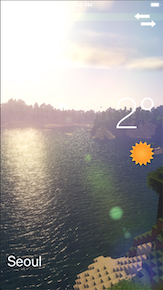

# Clima

Weather app for iOS 11

### Functionality

App consists of two screens. Main screen shows current location data as below. User can also tap button on top right to switch to city lookup function. 

On this screen, a user can type in any city and look up the weather conditions there.

Upon pressing the "Get Weather" button, the user is showed conditions in Toronto.

